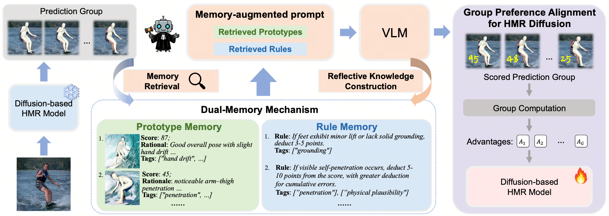

<div align="center">

# VLM-Guided Group Preference Alignment for Diffusion-based Human Mesh Recovery

<div>
    <a href='https://shenwenhao01.github.io/' target='_blank'>Wenhao Shen</a>&emsp;
    <a href='https://wanghao.tech/' target='_blank'>Hao Wang</a>&emsp;
    <a href='https://scholar.google.com/citations?user=zlIJwBEAAAAJ&hl=en' target='_blank'>Wanqi Yin</a>&emsp;
    <a href='https://fayaoliu.github.io/' target='_blank'>Fayao Liu</a>&emsp;
    <a href='https://dawdleryang.github.io/' target='_blank'>Xulei Yang</a>&emsp;
    <a href='https://github.com/VamosC' target='_blank'>Chao Liang</a>&emsp;
    <a href='https://caizhongang.github.io/' target='_blank'>Zhongang Cai</a>&emsp;
    <a href='https://guosheng.github.io/' target='_blank'>Guosheng Lin</a>&emsp;
</div>

<strong><a href='https://openaccess.thecvf.com/content/CVPR2026/papers/Shen_VLM-Guided_Group_Preference_Alignment_for_Diffusion-based_Human_Mesh_Recovery_CVPR_2026_paper.pdf' target='_blank'>CVPR 2026</a></strong>

</div>

---

<p align="center">
  
</p>

---

## 🛠️ Install
<details>
<summary>Set up the environment</summary>


```bash
conda create -n gpahmr python=3.8 -y
conda activate gpahmr
conda install pytorch==1.12.0 torchvision==0.13.0 torchaudio==0.12.0 cudatoolkit=11.3 -c pytorch -y
pip install mmcv-full==1.7.1 -f https://download.openmmlab.com/mmcv/dist/cu113/torch1.12.0/index.html
pip install -r requirements.txt

# install pytorch3d
pip install "git+https://github.com/facebookresearch/pytorch3d.git"
```

Please follow [ScoreHypo](https://github.com/xy02-05/ScoreHypo) to prepare data.

</details>


## 🚀 Pretrained Models
- download checkpoint from [OneDrive]()
  - put them under `./experiment/hyponet`


## 📝 Evaluation
Evaluation on 3DPW

```bash
torchrun --nproc_per_node=2 --master_port=23452 main/main.py --config config/test/test-3dpw-custom.yaml --exp experiment/scorenet --doc 3dpw --validate --multihypo_n 10 --batch_size 80
```

Evaluation on Human3.6M
```bash
torchrun --nproc_per_node=2 --master_port=23452 main/main.py --config config/test/test-h36m-custom.yaml --exp experiment/scorenet --doc h36m --validate --multihypo_n 10 --batch_size 80
```

## 🚄 Training

Train on 3DPW
```bash
torchrun --nproc_per_node=2 --master_port=23338 main/main.py --config config/train/hyponet/instavariety-3dpw-grpo-scorer.yaml --exp experiment/hyponet --doc 3dpw-ins-grpo
```
Train on Human3.6M

```bash
torchrun --nproc_per_node=2 --master_port=23336 main/main.py --config config/train/hyponet/instavariety-h36m-grpo-scorer.yaml --exp experiment/hyponet --doc h36m-ins-grpo
```


## 📚 Citation
If you find our work useful for your research, please consider citing the paper:
```
@inproceedings{shen2026gpahmr,
  title={VLM-Guided Group Preference Alignment for Diffusion-based Human Mesh Recovery},
  author={Shen, Wenhao and Wang, Hao and Yin, Wanqi and Liu, Fayao and Yang, Xulei and Liang, Chao and Cai, Zhongang and Lin, Guosheng},
  booktitle={Proceedings of the IEEE/CVF Conference on Computer Vision and Pattern Recognition},
  pages={13918--13929},
  year={2026}
}
```

## 👏 Acknowledgement
This repo is built on the excellent work [ScoreHypo](https://github.com/xy02-05/ScoreHypo). Thanks for their great projects.
